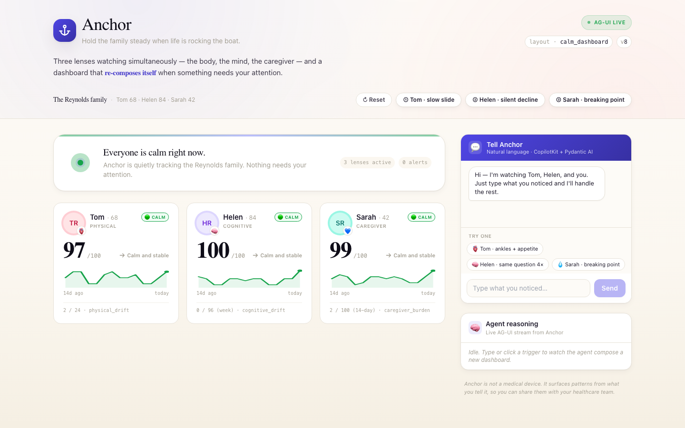
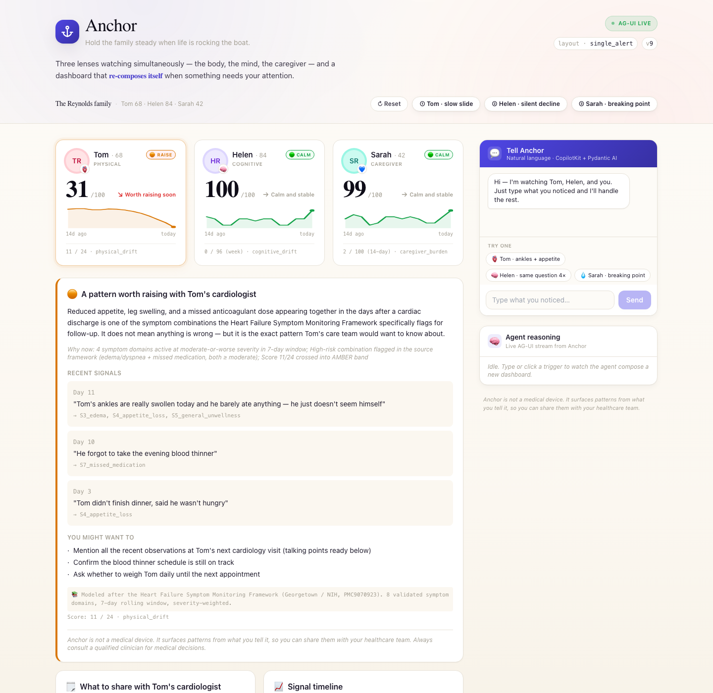
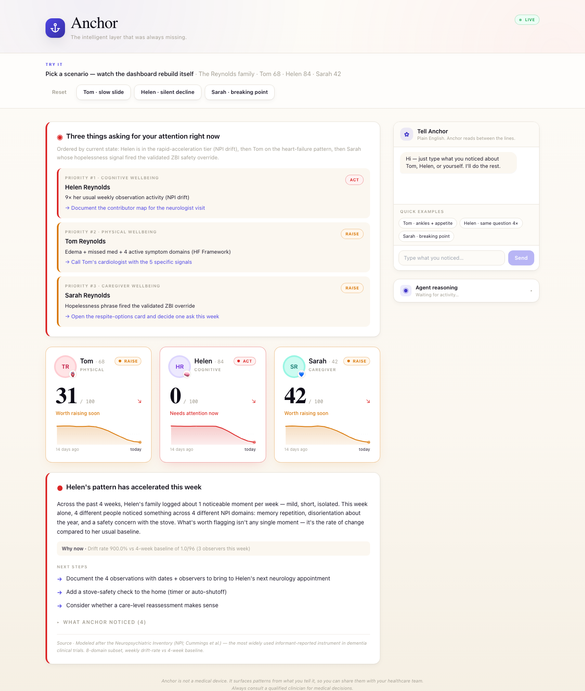

# ⚓ Anchor

> **Hold the family steady when life is rocking the boat.**
> Three lenses, one app — the patient's body, the patient's mind, and the
> caregiver's breaking point.

Anchor is a **generative-UI** application built for the *Generative UI
Global Hackathon* (May 9, 2026 — San Francisco). The agent reads casual
observations from family caregivers, runs three peer-reviewed clinical
instruments under the hood, and **rebuilds the dashboard in real time**
when something needs attention. There is no static layout. Every render
is composed by the agent for the moment it's in.



## Why this is generative UI (not a chatbot)

| Moment | What the agent renders |
|---|---|
| Calm baseline | Three quiet `DriftScoreCard`s + green sparklines + `FamilyLoadMeter` at calm |
| Tom's HF pattern fires | `single_alert` — amber card, sparkline crashes 95→37, `FamilyLoadMeter` rising, `CarePlanCard` with 4 delegated steps |
| Helen's family logs 4 cognitive incidents | `combined_triage` — contributor pattern + cognitive drift chart |
| Sarah types *"I don't know how much longer I can do this"* | Caregiver crossing added; `FamilyLoadMeter` → critical; `CarePlanCard` updated with Z-domain steps |
| All three at once | `combined_triage` — ordered by urgency, `GenerationReceipt` shows which tools fired |

**The "Copilot That Ships" moment:** clicking "Approve & draft" on any care plan step
opens an inline `DraftMessagePanel` with the message pre-written and 5 tone chips
(Caring / Softer / More direct / Shorter / Add specifics) that regenerate the draft live.

A chatbot can't do this. A pre-built dashboard can't do this. **That's
the point.**

### Tom's pattern fires (single_alert)


### Combined triage (all three lenses active)


## Stack

| Layer | Choice |
|---|---|
| Agent | Pydantic AI |
| LLM | Gemini 2.5 Flash (free tier via Google AI Studio); deterministic fallback always works offline |
| Protocols | A2UI (UI Plan JSON) · AG-UI (event stream) · MCP (8 tools) · CopilotKit (UI patterns) |
| Backend | FastAPI · uv · Python 3.11 |
| Frontend | React 18 · Vite · Tailwind · TypeScript |
| Scoring | Three peer-reviewed instruments — HF Framework (PMC9070923) / NPI (Cummings et al.) / ZBI-12 (PMC6497029) |
| Design | Premium-calm: indigo + coral on warm cream; Fraunces display serif |

## Quick start

### Backend

```bash
cd backend
uv venv
source .venv/bin/activate
uv pip install -e .
echo "GOOGLE_API_KEY=your-gemini-key-here" > .env   # optional — deterministic mode works without
uv run uvicorn app.main:app --reload --port 8000
```

Visit <http://localhost:8000/health> to confirm it's alive,
<http://localhost:8000/docs> for the API.

Get a free Gemini API key at <https://aistudio.google.com/app/apikey>.
**To force deterministic mode** (no LLM, no quota burn — useful for dev
and demo-day rate-limit safety):

```bash
ANCHOR_FORCE_DETERMINISTIC=1 uv run uvicorn app.main:app --reload --port 8000
```

### Frontend

```bash
cd frontend
npm install
npm run dev
```

Visit <http://localhost:5173>.

## Demo flow

The simplest end-to-end check (everything in one shell):

```bash
# 1. Reset to clean baseline
curl -X POST http://localhost:8000/demo/reset

# 2. Trip Tom's heart-failure pattern
curl -X POST http://localhost:8000/demo/uc1

# 3. Trip Helen's cognitive-acceleration pattern (4 observers)
curl -X POST http://localhost:8000/demo/uc2

# 4. Trip Sarah's caregiver-burnout pattern (Z10 override)
curl -X POST http://localhost:8000/demo/uc3
```

Each call returns a fresh `UIPlan` JSON. The frontend subscribes via SSE
and re-renders the dashboard live.

For the full interactive demo path (chat-driven), see `JUDGES_README.md`.

## Repository layout

```
JUDGES_README.md            # ⭐ Start here — demo path + protocol map
ANCHOR_SPEC.md              # Full product spec — single source of truth
SUBMISSION.md               # Hackathon submission packet
docs/screenshots/           # Visual state of all layouts
backend/app/
  ck_agent.py               # CopilotKit FastAPI integration + /api/copilotkit/*
  plan_builder.py           # Deterministic UIPlan composer (safety net)
  main.py                   # FastAPI app + /demo/* endpoints + SSE
  ui_plan.py                # Pydantic models: 13 components, 3 layouts
  prompts/system.md         # Agent system prompt
  data/
    demo_dataset.py         # Reynolds family + 4-week NPI baseline + triggers
    language_rules.py       # Safer-language constants + state→color mapping
  mcp_tools/
    observation_parser.py   # NLP signal extraction (28 validated IDs)
    scoring.py              # 3 peer-reviewed instruments (HF/NPI/ZBI-12)
    patterns.py             # Pattern matchers w/ citations
    support.py              # Local-support lookup + talking-points draft
    __init__.py             # ALL_TOOLS list (8 tools)
frontend/src/
  App.tsx                   # Dashboard + auto-reset + auto-scroll to care plan
  components/
    A2UIComponents.tsx      # All component renderers incl. FamilyLoadMeter,
                            #   CarePlanCard (+ DraftMessagePanel), GenerationReceipt
    AnchorChat.tsx          # Natural-language entry; onSent closes the drawer
    FloatingChatDrawer.tsx  # Bottom-left pill → slide-up chat panel
    Layouts.tsx             # 3 layout dispatchers; calm banner watches drift state
    Sparkline.tsx           # Pure-SVG mini chart
    cardHelpers.ts          # Avatars, lens icons, sparkline series
    CopilotKitProtocolProof.tsx  # useCoAgent + useCopilotAction proof surface
  hooks/useAGUIStream.ts    # SSE subscription → ag-ui event parsing
  types/uiPlan.ts           # TypeScript mirror of Pydantic models
  styles/index.css          # Fraunces + Inter + JetBrains Mono
```

## Safer-language commitment

Anchor is **not** a medical device. It surfaces patterns from
observations its users record, with citations to the published
instruments it uses, so users can have better conversations with their
healthcare team. The agent prompt enforces a strict no-clinical-claim
banned-phrase list (see `backend/app/data/language_rules.py`) and every
alert card carries a verbatim disclaimer.

## License

MIT (TBD — finalised at submission).
